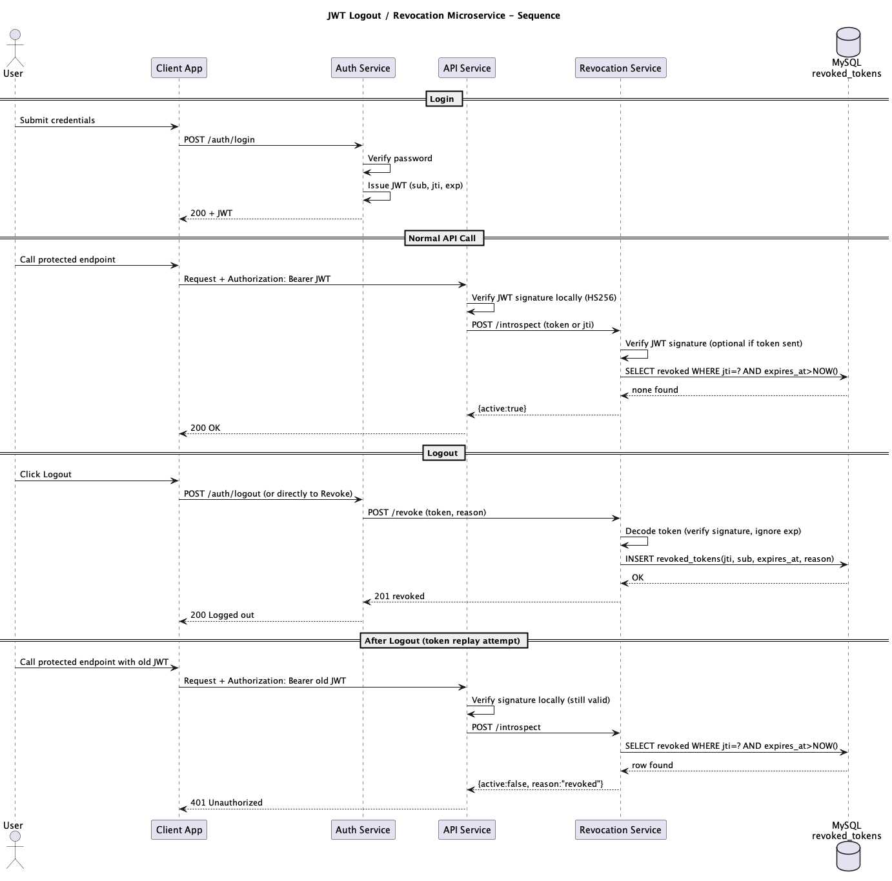

# Logout Token Revocation Service

Flask microservice for JWT token revocation.

It stores revoked JWT `jti` values in a database and exposes endpoints to:
- revoke a token
- validate whether a token has been revoked


## Tech Stack
- check requirements.txt

## Project Structure

- `main.py` 
- `app/routes/revoke.py` 
- `app/models.py` 
- `app/db.py` 
- `config.py`
- `templates/test_revoke.html` 
- `db.sql` 


### Run with MySQL
.venv/bin/python main.py
```
`http://localhost:5001`

```

## Routes

### `GET /`
Serves the HTML tester page for manual revoke/validate testing.

### `GET /health`


### `POST /revoke`
Decode a JWT and store its `jti` in `revoked_tokens`.


Responses:
- `201` when newly revoked
- `200` when token was already revoked
- `400` when token missing
- `422` when token is invalid or missing claims
- `503` on DB errors

### `GET /validate/<jti>`
Returns whether the token ID is revoked.


### `DELETE /cleanup`
Deletes rows where `expires_at` is in the past.


## UML diagram

